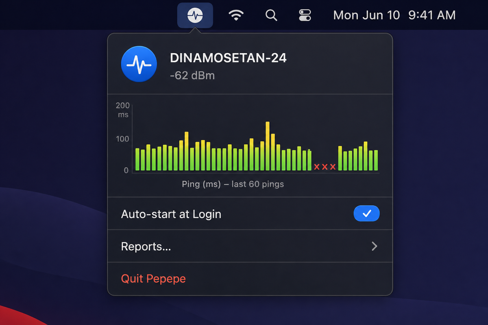
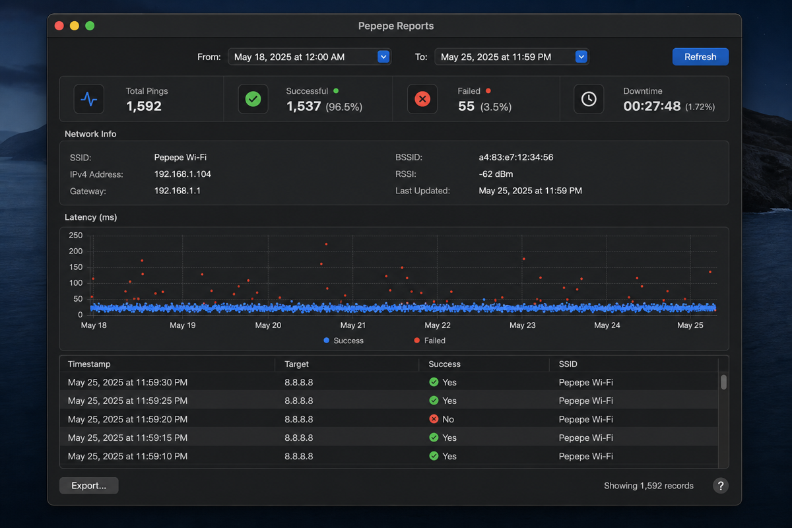

# pepepe

[](https://github.com/anggiedimasta/pepepe/releases)
[]()
[]()
[](LICENSE)

macos menu bar app. pings cloudflare + google dns, tracks your wifi, tells you when internet acting up.

made this because i keep blaming wifi when it's actually just my isp having a moment. now i have receipts.

## screenshots

| menu bar popover | reports |
|---|---|
|  |  |

## what you get

- sparkline in menu bar (green/orange/red based on latency)
- click it → ping chart, ssid, signal strength
- pings 1.1.1.1 and 8.8.8.8 every 2 seconds while running
- logs everything to sqlite, survives restarts
- reports window with date range, stat cards, chart, full network info + csv export
- csv rows include wifi context: ssid, ip, gateway, bssid, rssi, dns — so you can tell if ping failed because wifi died or internet died
- notifications on drop / weak signal
- auto-start at login if you want

## requirements

macos 14+, swift 6 to build from source

location permission required — macos won't give you ssid without it. annoying but not my rule.

## install

**recommended — homebrew:**

```bash
brew tap anggiedimasta/pepepe https://github.com/anggiedimasta/pepepe
brew install --cask pepepe
```

no xattr, no right-click open. just install.

**manual:** download zip from [releases](https://github.com/anggiedimasta/pepepe/releases), unzip, drag to applications. macos might say "damaged" (unsigned app + browser quarantine) — fix with `xattr -cr /Applications/Pepepe.app` or right-click → Open.

**from source:**

```bash
chmod +x build_app.sh
./build_app.sh
```

## data

sqlite db: `~/Library/Application Support/Pepepe/pepepe.sqlite`

export csv from reports window when you need the full dump. data older than 30 days is auto-cleared; use **clear all** in reports to wipe everything.

## license

mit
